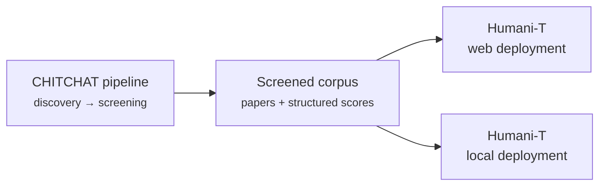

# Humani-T

Version 1 in development

**CHITCHAT** is the research project and the pipeline behind it. **Humani-T**
is the application people actually use: an interface onto what the pipeline
produces.

Where CHITCHAT answers *"what does the literature say about humanitarian
alignment in conversational AI?"*, Humani-T answers the question a team
actually arrives with — *"I am building this system, in this environment, for
these beneficiaries: which ethical tradeoffs apply to me, and how have
researchers resolved them?"*

!!! note "Work in progress"

    Version 1 is in development. These pages are placeholders — the structure
    is here so documentation can be written alongside the build rather than
    after it.

## Two deployments

Humani-T ships in two forms, over the same core and the same corpus.

-   :material-web:{ .lg .middle } __Web deployment__

    ---

    Hosted and shared. For teams working with connectivity, who want the
    current corpus without installing anything.

    [:octicons-arrow-right-24: Web deployment](web.md)

-   :material-laptop:{ .lg .middle } __Local deployment__

    ---

    Runs on your own machine against a local copy of the corpus. For
    constrained, offline or sensitive settings.

    [:octicons-arrow-right-24: Local deployment](local.md)

| | Web | Local |
| --- | --- | --- |
| Where it runs | Hosted | Your machine |
| Network required | Yes | No, once the corpus is in place |
| Corpus | Current published snapshot | Whatever snapshot you hold |
| Best for | Everyday use, sharing results | Field, air-gapped or sensitive settings |

## How it relates to the pipeline

Humani-T is downstream of everything in [The pipeline](../pipeline/index.md).
It does not search, screen or score; it presents what the pipeline produced,
and the [screening schema](../modules/screening-schema.md) is the contract
between them.

## Still needed

- [ ] Scope of Version 1 — what is in and what is explicitly deferred
- [ ] The data contract between the corpus and the application
- [ ] Deployment and update procedure for each form
- [ ] Who it is for, and the limits of what it should be used to decide
