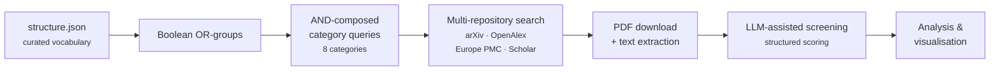

# The pipeline

CHITCHAT turns a curated vocabulary of research concepts into a screened,
deduplicated corpus of papers. Six stages, each reading a file and writing a
file.

Because every stage hands a plain data file to the next, any stage can be
re-run, inspected or swapped out on its own — and you can enter the pipeline
wherever you already have the input.

## The stages

| # | Stage | What it does | Status |
| --- | --- | --- | --- |
| 1 | [Boolean combinations](boolean-combinations.md) | Expands each term and its synonyms into quoted `OR` groups for exact-phrase matching | Documented |
| 2 | [Unique combinations](unique-combinations.md) | Joins those groups with `AND` across the eight research categories | Documented |
| 3 | [arXiv search](arxiv-search.md) | Queries arXiv, respecting its rate limits | Documented |
| 4 | [Multi-repository search](multi-repository-search.md) | Queries OpenAlex, Europe PMC and Google Scholar; deduplicates; downloads and extracts PDFs | Documented |
| 5 | [Screening](screening.md) | Scores each paper for relevance against a structured schema and assigns a priority | Documented |
| 6 | [Analysis](analysis.md) | Produces plots over both the raw scrape and the screening results | Undocumented |

[Running the pipeline](running.md) covers the shell scripts, local execution
and the EPFL RCP cluster.

## Why it is built this way

Three commitments shape the design.

**Transparency.** Nothing in the process is implicit. The term list, the query
logic, the sources and the screening criteria are all artefacts you can read.

**Reproducibility.** Someone else, starting from the same repository, gets the
same result — and can change one input to see what it changes. Re-running with
an updated vocabulary produces an updated review; the difference between two
runs is itself something you can look at.

**Auditability.** Automated screening narrows the field; it does not make the
final call. The pipeline is built so a human can see what was excluded and why.

!!! danger "What this pipeline does not do"

    It does not decide what is relevant. LLM-assisted screening is a triage
    step that lets human reviewers spend their attention where it counts.
    Read [Limitations & intended use](../project/limitations.md) before citing
    any output.

## Data contracts

Each stage page documents its own input and output format in full. In summary:

| Artefact | Produced by | Shape |
| --- | --- | --- |
| `structure.json` | authored by hand | concepts → synonym lists, grouped by category |
| `boolean_combinations.json` | stage 1 | one quoted `OR` group per concept |
| `unique_boolean_combinations.json` | stage 2 | `{Combination_title, boolean_combination}` per category |
| `obtained_lit.json` | stages 3–4 | `Paper` records: metadata, abstract, extracted full text |
| `screening_results_*.jsonl` | stage 5 | one structured screening record per paper |
